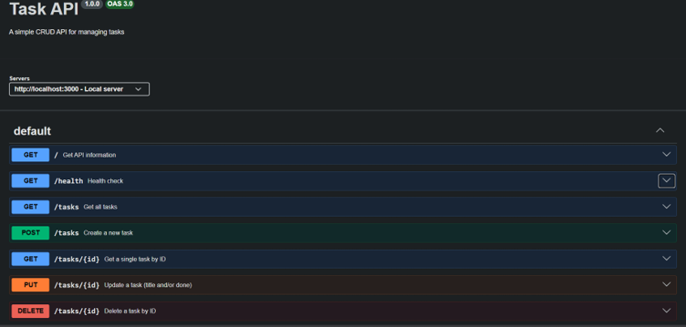

# CRUD API

A CRUD (Create, Read, Update, Delete) REST API built with **Node.js + Express** as part of the FlyRank AI Internship Backend Engineering Track.

## Features

- Create tasks
- Read all tasks
- Read a single task
- Update tasks
- Delete tasks
- Input validation
- Interactive Swagger UI documentation

## Technologies

- Node.js
- Express.js
- Swagger UI (OpenAPI 3.0)

## Installation

1. Clone the repository

```bash
git clone https://github.com/vuysanan/CRUD-API.git
```

2. Navigate to the project
```bash
cd CRUD-API
```

3. Install dependencies
```bash
npm install
```

4. Run the server

```bash
node server.js
```

The API will be available at:

```
http://localhost:3000
```

Swagger UI:

```
http://localhost:3000/docs
```

##Endpoints

## Endpoints

| Method | Endpoint | Description |
|--------|----------|-------------|
| GET | / | API information |
| GET | /health | Health check |
| GET | /tasks | Get all tasks |
| GET | /tasks/{id} | Get a task by ID |
| POST | /tasks | Create a new task |
| PUT | /tasks/{id} | Update a task |
| DELETE | /tasks/{id} | Delete a task |

## Example curl request

```bash
curl -i http://localhost:3000/tasks
```

Example output

```http
HTTP/1.1 200 OK
content-type: application/json

[
  {
    "id": 1,
    "title": "Practice JavaScript",
    "done": true
  },
  {
    "id": 2,
    "title": "Build an API",
    "done": false
  }
]
```

## Swagger UI


