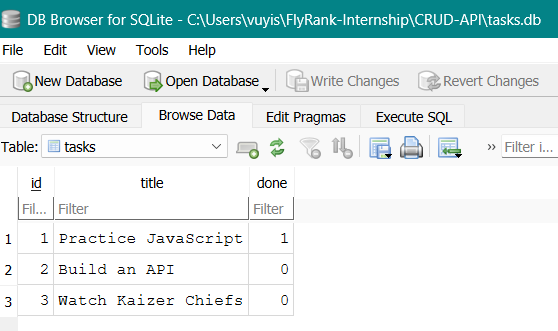
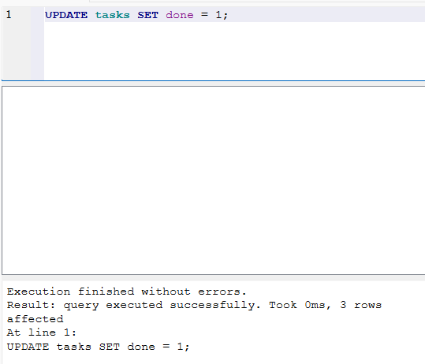
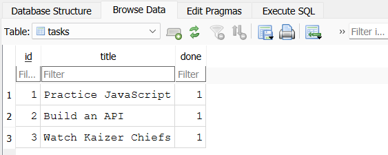
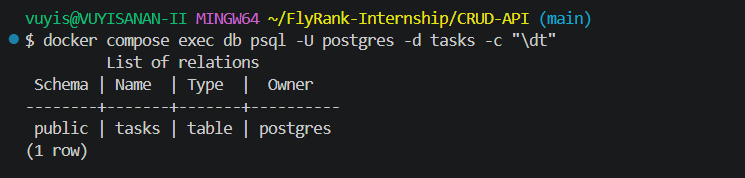
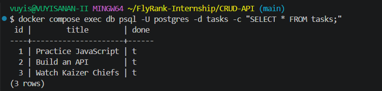

# CRUD API

A CRUD (Create, Read, Update, Delete) REST API built with **Node.js + Express** as part of the FlyRank AI Internship Backend Engineering Track.

## Features

- Create tasks
- Read all tasks
- Read a single task
- Update tasks
- Delete tasks
- Input validation
- Interactive Swagger UI documentation
- Data persistence

## Technologies

- Node.js
- Express.js
- Swagger UI (OpenAPI 3.0)
- PostgresSQL
- Docker

# Assignmnent 1

## Installation

1. Clone the repository

```bash
git clone https://github.com/vuysanan/CRUD-API.git
```

2. Navigate to the project
```bash
cd CRUD-API
```

3. Install dependencies
```bash
npm install
```

4. Run the server

```bash
node server.js
```

The API will be available at:

```
http://localhost:3000
```

Swagger UI:

```
http://localhost:3000/docs
```

## Endpoints

| Method | Endpoint | Description |
|--------|----------|-------------|
| GET | / | API information |
| GET | /health | Health check |
| GET | /tasks | Get all tasks |
| GET | /tasks/{id} | Get a task by ID |
| POST | /tasks | Create a new task |
| PUT | /tasks/{id} | Update a task |
| DELETE | /tasks/{id} | Delete a task |

## Example curl request

```bash
curl -i http://localhost:3000/tasks
```

Output

```http
HTTP/1.1 200 OK
content-type: application/json

[
  {
    "id": 1,
    "title": "Practice JavaScript",
    "done": true
  },
  {
    "id": 2,
    "title": "Build an API",
    "done": false
  }
]
```

## Swagger UI


# Assignment 2

## Connecting a Database

### Why SQLite
* I chose SQLite because it is a serverless, zero setup database that lives in a single file, allowing my task data to survive server restarts.

### Where the data lives
* The data is stored in a file called tasks.db. This file is git-ignored and will be created automatically the first time you run the server.

### SQL Query Example (Stage 4)

``` sql
UPDATE tasks SET done = 1;
```

* This query sets the completion status of all the tasks to 1 which represents True meaning they are all done






# Assignment 3 - Containerize your stack

* Goal: Run the task API against a real Postgres database in Docker — then start the whole app and its database with one command.

## Running Postgres locally (Stage 0)

* The database runs in a Docker container using PostgreSQL version 16. To start the database server, run:

```bash
docker run --name taskdb -e POSTGRES_PASSWORD=dev -e POSTGRES_DB=tasks -p 5432:5432 -v taskdata:/var/lib/postgresql/data -d postgres:16
```

## Installation & Running Locally

* This API and its PostgreSQL database are containerized using Docker. You can start the entire stack with a single command.

1. Clone the repository:
```bash
git clone https://github.com/vuysanan/CRUD-API.git
```

2. Navigate to the project
```bash
cd CRUD-API
```

3. Setup environment variables by copying the example file
```bash
cp .env.example .env
```

4. Start the application and database
```bash
docker compose up
```
The API will be available at http://localhost:3000 and the Swagger UI at http://localhost:3000/docs

## Endpoints

| Method | Endpoint | Description |
|--------|----------|-------------|
| GET | / | API information |
| GET | /health | Health check |
| GET | /tasks | Get all tasks |
| GET | /tasks/{id} | Get a task by ID |
| POST | /tasks | Create a new task |
| PUT | /tasks/{id} | Update a task |
| DELETE | /tasks/{id} | Delete a task |

## Example curl request

```bash
curl -i http://localhost:3000/tasks
```

Output

```http
HTTP/1.1 200 OK
content-type: application/json; charset=utf-8

[
  {
    "id": 1,
    "title": "Practice JavaScript",
    "done": true
  },
  {
    "id": 2,
    "title": "Build an API",
    "done": true
  },
  {
    "id": 3,
    "title": "Watch Kaizer Chiefs",
    "done": true
  }
]
```
## Screenshots


